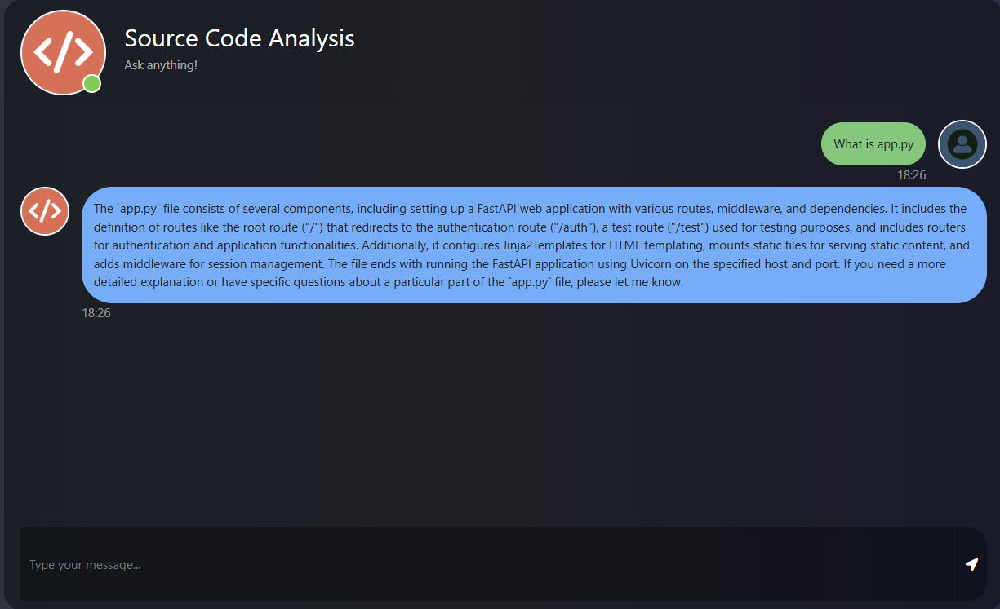

# Running a GitHub Source Code Analysis
This project is a web-based code analysis assistant that lets users submit a GitHub repository URL, automatically clones the repo, processes the Python source files using LangChain, and creates embeddings with OpenAI GPT to enable intelligent code-related Q&A. It uses ChromaDB as the vector store and provides a conversational interface powered by a memory-enabled OpenAI chat model.



#### How to Run?

### Step 1-: Clone the Repository
```
git clone https://github.com/midofemi/Source_Code_Analysis_Git.git
```

### Steps 2-: Create a Virtual Environment
```
conda create -p venv python==3.12.3 -y
```

### Step 3-: Activate Conda environment
```
conda activate venv/
```

### Step 4-: Install requirements
```
pip install -r requirements.txt
```

### Step 5-: Store Your OpenAI API Key on .env
```
Before starting your application, you'll need to create a .env and store your API Key

OPENAI_API_KEY = "XXXXXXXXXXXXXXXXXXXXXXXXXXXXXXXXXXXXXXXXXXXXXXXXXXXXXX"

```

### Step 6-: Start the Application
```
python app.py
```

### Visit http://localhost:8080 to interact with your PDF chatbot.